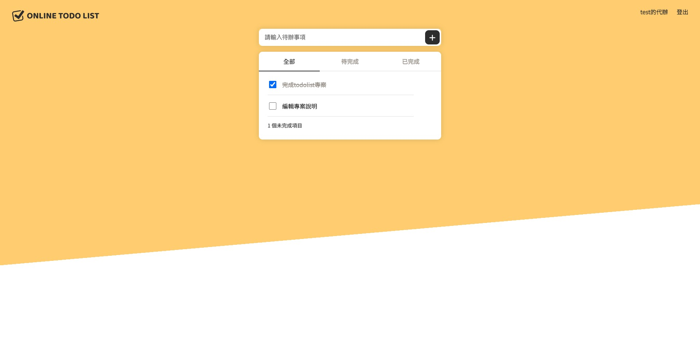

# Vue3 Todolist

此專案是一個使用 Vite + Vue3 開發的 Todolist，具備 使用者驗證 與 待辦事項管理 功能，並透過 API 讓資料持久化。此專案的設計重點是展示 前端工程能力 與 良好程式結構，作為求職作品。

## ✨ 主要功能

- **使用者系統**：登入 / 註冊 / 登出
- **待辦事項管理**：
  - 新增、刪除、編輯
  - 標記完成 / 未完成
- **資料持久化**：與 API 串接，資料不會隨頁面刷新消失
- **錯誤處理與驗證**：避免未登入操作或輸入空白項目

## 🚀 Demo

[線上體驗連結](https://sumaoxiong.github.io/vue3-Todolist-API/#/login)

## 📸 專案畫面



## 🛠 使用技術

- **前端框架**：Vue3 (Composition API)、Vite
- **API 串接**：axios
- **開發工具**：ESLint、GitHub Pages (部署)
- **後端 API**：六角學院 Todolist API

## 專案結構

```
vue3-Todolist-API/
├── public/                 # 靜態資源
├── src/
│   ├── assets/             # 圖片與樣式
│   ├── components/         # 可重複使用的元件
│   │   ├── TodoForm.vue    # 新增待辦輸入區塊
│   │   ├── TodoItem.vue    # 單一待辦項目
│   │   └── TodoList.vue    # 待辦清單容器
│   ├── views/              # 頁面 (對應路由)
│   │   ├── LoginView.vue       # 登入頁面
│   │   ├── RegisterView.vue    # 註冊頁面
│   │   ├── TodoListView.vue    # 待辦清單頁面
│   │   └── NotFoundView.vue    # 404 頁面
│   ├── App.vue             # 根組件
│   └── main.js             # 入口檔案
├── package.json
├── vite.config.js
└── ...

```

## 🎯 專案目標

- 強化 **Vue3 Composition API** 與元件化思維
- 練習 **前後端 API 串接** 與 Token 驗證
- 展示 **乾淨的程式碼結構** 與 **良好的專案管理習慣**
- 作為 **前端工程師求職作品**，清楚呈現開發能力

## 環境建置

1. 複製專案

```sh
git clone <repo-url>
```

2. 進入專案資料夾

```sh
cd vue3-Todolist-API
```

3. 安裝套件

```sh
npm install
```

4. 運行專案

```sh
npm run dev
```

5. 停止運行專案
   鍵盤 ctrl/control + C

## 其他指令

**靜態檔案生成**

```sh
npm run build
```

**程式碼檢查**

```sh
npm run lint
```

> 建議在 commit 前執行 ESLint，確保程式碼符合規範
